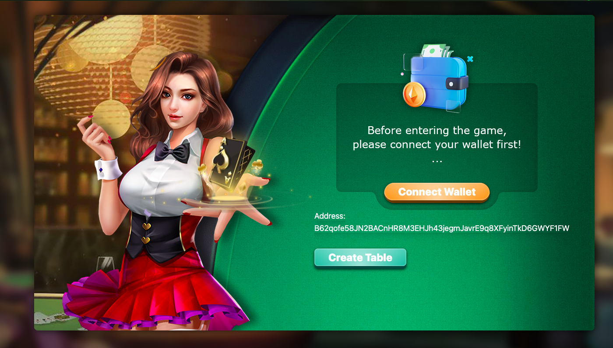

# Mina zkApp: Mina Poker

## Overview

MinaPoker represents a groundbreaking approach in the online poker industry, merging the thrill of poker with the robust security and anonymity offered by cryptocurrencies. This platform harnesses the power of blockchain technology to create a decentralized, transparent, and secure environment for poker enthusiasts worldwide.




### Key Features

- **Decentralized Gaming**: Built on the MINA blockchain, MinaPoker ensures a tamper-proof gaming environment, free from centralized control.
- **Secure Transactions**: Utilizes cryptocurrencies for transactions, providing instant and secure means of deposits and withdrawals.
- **Anonymity**: Players enjoy the freedom to play anonymously, safeguarding their personal information.
- **Provably Fair Gameplay**: Every hand in the game is demonstrably fair, ensuring an equal chance of winning for all participants.
- **User-Friendly Interface**: The platform offers a seamless and immersive poker experience, accessible to both experienced players and novices.

## Technical Architecture


### Frontend (NextJS)
- **AuroWallet Integration**: Enables user authentication through AuroWallet, ensuring secure access to the platform.
- **Table Creation**: Players can create custom poker tables, specifying parameters like bids and number of rounds.
- **Game Page**: Post-table creation, players engage in the game, where the frontend interacts with smart contracts for the game logic.

### Backend (NodeJS)
- **Blockchain Communication**: Facilitates interaction between the frontend and the MINA blockchain.
- **Session Management**: Manages user sessions for seamless transitions across the platform.

### Smart Contracts (zk-Proofs with o1js)
- **Game Logic**: Implements the core poker game rules and mechanics, deploying these on the MINA blockchain for decentralized execution.

### MINA Blockchain
- **Smart Contract Deployment**: Hosts the smart contracts, ensuring a decentralized and secure gaming process.

## Usage and Gameplay

### Getting Started
- **AuroWallet Login**: Players begin by logging in via AuroWallet, which handles user authentication.
- **Table Creation**: Users can create a poker table with specific game parameters.
- **Gameplay**: Players are directed to the game page after table selection, engaging in poker through interactions with smart contracts.

### Formats
MinaPoker offers diverse game formats, including:
1. **Ring Games**: Flexible gameplay similar to a test match in cricket.
2. **Multi-Table Tournaments**: Competitive play with increasing blinds, akin to one-day cricket matches.
3. **Sit N Go’s**: Short, action-packed games comparable to T20 cricket.


## How to build

```sh
npm run build
```

## How to run tests

```sh
npm run test
npm run testw # watch mode
```

# Test Cases

### 1. Smart Contract Deployment Test

**Objective**: Ensure successful deployment of MinaPoker smart contracts on the MINA blockchain.

**Steps**:
1. Deploy MinaPoker smart contracts.
2. Verify that the smart contracts are successfully deployed on the MINA blockchain.
3. Check the contract addresses and ensure they match the expected values.

### 2. Game Initialization Test

**Objective**: Test the initialization of a poker game, including player assignment and initial game state.

**Steps**:
1. Create a poker game with two players.
2. Verify that the players are correctly assigned to player1 and player2.
3. Check the initial game state, including pot amount, winner status, and other relevant parameters.

### 3. Betting Test

**Objective**: Test the betting functionality of the poker game.

**Steps**:
1. Place bets by players during different rounds.
2. Verify that the bet amounts are correctly updated for each player.
3. Ensure that the pot amount reflects the total bets placed by all players.

### 4. Hand Revelation Test

**Objective**: Test the functionality of revealing hands at the end of a poker round.

**Steps**:
1. Simulate the end of a poker round.
2. Players reveal their hands.
3. Verify that the hand strength is calculated correctly for each player.
4. Determine the winner based on hand strength and update the game state accordingly.

### 5. Player Interaction Test

**Objective**: Test the interaction between players during the game.

**Steps**:
1. Simulate player actions such as folding, calling, and raising.
2. Verify that the game state is updated correctly based on player actions.
3. Ensure that players cannot make invalid moves (e.g., bet more than their available chips).

### 6. Security and ZK Proofs Test

**Objective**: Test the security measures, including the use of zero-knowledge proofs.

**Steps**:
1. Verify that sensitive information is handled securely using zero-knowledge proofs.
2. Test the implementation of security measures based on feedback from external security audits.
3. Ensure that user data and transactions remain private and tamper-proof.

### 7. Frontend Integration Test

**Objective**: Test the integration between the frontend and smart contracts.

**Steps**:
1. Interact with the frontend to create a poker table.
2. Join the game and perform various actions through the frontend interface.
3. Verify that frontend interactions correctly trigger corresponding smart contract functions.


## How to run coverage

```sh
npm run coverage
```

## License

[Apache-2.0](LICENSE)
